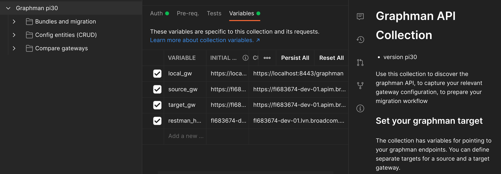
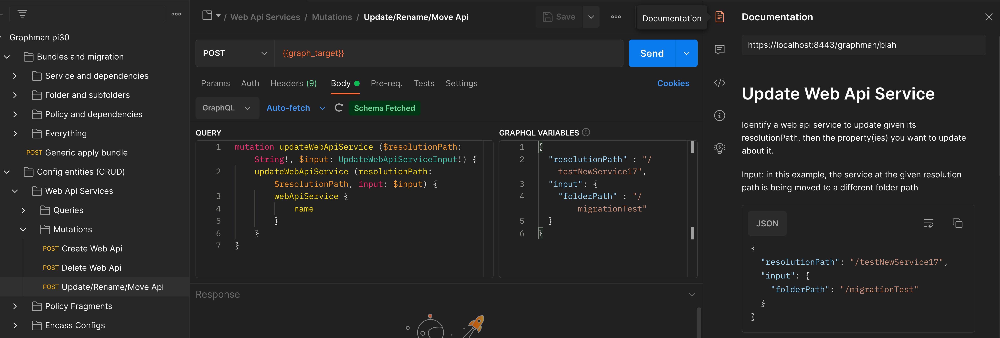

# Graphman client

Graphman is an API running on a Layer7 Gateway for interacting with the gateway configuration. This API
lets you retrieve full or partial gateway configuration from a Layer7 Gateway with Graphman running on it,
bundle configuration for the purposes of applying configuration as code and apply configuration to a
gateway.

Graphman is a GraphQL API but you don't need prior experience with, or an understanding of GraphQL to use it
with this client. This client abstracts out the GraphQL API layer by providing commands to perform common
Graphman operations. Power users can dive into the GraphQL layer to create their own queries that can then be
used with this client. Custom GraphQL queries let you control the specific configuration that needs to be
bundled for your domain-specific use case. To help dive into that layer, power users should refer to the 
provided Postman collection which provides samples for all the queries and mutations supported by Graphman.

# Jump to
1. [Using in Postman](#postman)
2. [Getting Started with the Command-line (CLI)](#cli)
3. [Graphman bundles explained](#bundles)

# Graphman client CLI

## Getting Started with the CLI <a name="cli"></a>

To get started with the command line interface, you need to have node.js installed on your system. You can
check that you have node installed by running this command:
```
node -v
```

If node is not already installed on your system, you can download it from https://nodejs.org/en/download/.

Next, set the environmental variable GRAPHMAN_HOME to the path where this packaged is installed. For
example:
```
export GRAPHMAN_HOME=~/dev/mygraphmanclient
```

Then, you configure the Graphman endpoints to interact with by editing the file graphman.configuration. For
example:
```
{
  "sourceGateway": {
    "address": "https://some-source-gateway:8443/graphman",
    "username": "admin",
    "password": "7layer",
    "rejectUnauthorized": false,
    "passphrase": "7layer"
  },

  "targetGateway": {
    "address": "https://some-target-gateway:8443/graphman",
    "username": "admin",
    "password": "7layer",
    "rejectUnauthorized": false,
    "passphrase": "7layer"
  }
}
```

If you wish to authenticate using a certificate provide the following values in the file graphman.configuration:
```
{
  "sourceGateway": {
    "address": "https://some-source-gateway:8443/graphman",
    "certFilename": "authentication-certificate.pem",
    "keyFilename": "authentication-certificate.key",
    "rejectUnauthorized": false,
    "passphrase": "7layer"
  },

  "targetGateway": {
    "address": "https://some-target-gateway:6443/graphman",
    "certFilename": "authentication-certificate.pem",
    "keyFilename": "authentication-certificate.key",
    "rejectUnauthorized": false,
    "passphrase": "7layer"
  }
}
```

You are now ready to start using Graphman. To bundle the entire configuration of the source gateway, run the
following command:
```
./graphman.sh export --using all --output mybundle.json
```

You can apply this configuration bundle as-is to the target gateway.
```
./graphman.sh import --input mybundle.json
```

Congratulations, you just packaged all the configuration from the source gateway, and applied it to the
target gateway.

> **Note**
> Use platform specific entrypoint to interact with the GRAPHMAN. 
> 
> - Windows - graphman.bat
> 
> - Linux - graphman.sh

> **Note**
> Running GRAPHMAN with no arguments shows the description about the supported operations. Try it out.

> **Warning**
> Graphman is still under continuous development to extend its support to the gateway entities. 
> As GraphQL schema is subjected to the frequent modifications, new or modified queries may not be compatible with the older gateways. 
> Because of which, CLI is improved to work with multiple schemas. Use configuration file or CLI argument to decide the schema to work with.
> - "schemaVersion": <schema-version>
> - --schemaVersion <schema-version>
> 
> Supported schemas are:
> - 11.0-CR01 (default) 
> - 10.1-CR03
> 
## Graphman configuration bundles <a name="bundles"></a>

Graphman bundles are collections of 0 or more Layer7 Gateway configuration entities. You can combine any
entities together, no matter their type. Here is an example bundle containing a cluster-wide property and 
a jdbc connection:

```
{
  "clusterProperties": [
    {
      "name": "a",
      "value": "a",
      "description": "a cwp",
      "hiddenProperty": false,
      "checksum": "e0aa4e7fb2a69405c8aec3e242a8f7c99e4c9a76"
    }
  ],
  "jdbcConnections": [
    {
      "name": "mydb",
      "driverClass": "com.l7tech.jdbc.mysql.MySQLDriver",
      "jdbcUrl": "jdbc://mydb/mydb",
      "enabled": true,
      "username": "hello",
      "password": "${secpass.mydb.plaintext}",
      "minPoolSize": 3,
      "maxPoolSize": 15,
      "properties": [
        {
          "name": "EnableCancelTimeout",
          "value": "true"
        }
      ],
      "checksum": "15059c05def480b53e4a0b022da2b23e3881c500"
    }
  ]
}
```

### Single JSON bundle vs exploded configuration
Graphman configuration bundles are exported as JSON files but also have an 'exploded' representation where
each configuration entity is separated in its own individual JSON file organized in a folder structure.

To created an 'exploded' representation of a Graphman bundle, use this command:
```
./graphman.sh explode --input mybundle.json --output exploded
```

This will create a directory structure under exploded, which contains each configuration entity in its own
file. You manipulate the configuration in this directory structure directly (changing JSON file properties, 
delete some files, copy others, etc) and repackage it as a single bundle JSON by doing this reverse command.

```
./graphman.sh implode --input exploded --output mynewbundle.json
```

## Using the Graphman export command

The Graphman export command lets you create a bundle for specific entities based on a query targetting those
entities. The queries folder contains a number of sample queries that can be used for this purpose. The query
to use is provided to the command using the --using option. Here are some examples and how to use them.

### all

This query lets you package the entire configuration of a gateway. No input parameters are needed for this
one:
```
./graphman.sh export --using all --output mybundle.json
```

### folder

This sample query packages a combination of all policy fragments, web API services, and soap services
configuration entities that are at a specific folder path location as well as in children subfolders.

To export all policy fragments, web API services, and soap services configurations from a folder
/utils/foo and all its subfolders:
```
./graphman.sh export --using folder --variables.folderPath /utils/foo --output folderUtilsFoo.json
```

### webApiService
This query lets you package a particular web API service from the source gateway. You can package it with
or without its dependencies. You identify which web API service to pull by providing the command the
resolution path defined for this web API service.

To export /hello-world service without dependencies:
```
./graphman.sh export --using webApiService --variables.resolutionPath /hello-world --output hello-world.json
```
To export /hello-world service along with its dependencies:
```
./graphman.sh export --using webApiService:full --variables.resolutionPath /hello-world --output hello-world.json
```

### General using queries and creating your own queries
The folder 'queries' contains other queries you can use. Each query is defined in a .gql file and corresponding
.json files to wrap the query and its variables. You will notice some of the .gql files contain raw graphql
syntax (such as the example globalPoliciesAndTasks.gql) whereas others leverage a metadata mechanism that
centralizes the definition of which properties to use per entity type.

You can add your own queries by creating your own combo
.gql and .json files. The .gql can contain any GraphQL syntax that you paste from Postman for example.

## Using the Graphman import command

Use this command to import a specified gateway configuration bundle to a target gateway.

```
./graphman.sh import --input hello-world.json
```
You can override the gateway target details when you import bundles.
```
./graphman.sh import --input hello-world.json --targetGateway.address https://some-target:8443/graphman --targetGateway.username admin --targetGateway.password changeit
```

## Using the Graphman diff command

To compare the configuration between the two gateways, you can diff them using graphman.

```
./graphman.sh diff
```

The output of diff includes the difference for entities and a mapping of goid conflicts.

### Bundle the difference between two gateways

Graphman helps you bundle the delta between two gateways.

You can use the difference between two gateways to produce a configuration bundle that contains
this difference. You can use these bundles to bring up to date a target gateway based on its 
differences with a source gateway.

```
./graphman.sh diff --renew --output deltaBundle.json
```

### Subtracting a bundle from another

You can also use this client to subtract from a first bundle, the entities that exist in
a second bundle.

Why would you need to do this? For example, you want to remove an overlap between a framework
type configuration from a service and all its dependencies (e.g. you end up with unwanted OTK
config entities in a bundle). To perform this operation, use the diff command:
```
./graphman.sh diff --input tooBig.json --input whatToCut.json --output trimmed.json
```

## Using the Graphman combine command

You can combine two configuration bundles using the combine command:
```
./graphman.sh combine --input bundle1.bundle --input bundle2.bundle--output full.bundle
```

## Using the Graphman revise command

Revises the specified bundle using the target gateway. This operation is useful when 
the specified bundle has goid/guid references that are out of sync with respect to the 
target gateway.
```
./graphman.sh revise --input some-bundle.bundle --output renewed-bundle.bundle
```

## Using the Graphman renew command

Renews the specified bundle using the source gateway. This operation is useful when 
the specified bundle is outdated or incomplete.  
```
./graphman.sh renew --input some-bundle.bundle --output renewed-bundle.bundle
```

# Using Graphman in Postman <a name="postman"></a>

Use the collection provided in this package by importing it in Postman. Once in Postman, select
the root node of the Collection and open the documentation to get started. Assign two placeholder
variables {{source_gw}} and {{target_gw}} to point to your gateways as well as the admin credentials
as illustrated below.



The Postman collection contains sample Graphman requests organized in categories:
- Bundles and migration - samples showing how to create and apply samples according to different bundling strategies
- Config entities - For each entity types, how to create, read, update, delete (CRUD) those entities
- Summary and compare - Queries that compare various aspect of configuration between two gateways

Each request can be use as-is and has its own documentation.


Some folders contain multiple requests that work together via environment variables and are meant to be used sequentially.
For example under Bundle and Migration, a graphql query creates a graphman bundle which is then used as input in a graphql mutation.

You can create your own folder and copy/paste sample graphman requests into it to create your own configuration flow.

# Dealing with secrets in the gateway configuration

Of all the entity types, two of them contain sensitive information which is never in clear:
- Keys (Keystore entries used for example by listeners)
- Secrets (Secure Passwords and SSH keys)

A encryption passphrase provided by the graphman requester is used to encrypt and decrype these secrets. This
encryption passphrase is set with HTTP header name `l7-passphrase`. If missing, graphman will use its local master
passphrase to encrypt/decrypt these secrets. When using the utils .sh scripts provided, the encryption passphrase
is read from the local target.properties.

For a bundle to be importable on target, provide the same encryption passphrase when applying the bundle as was used
during the creation of the bundle.

The secret portion of the Key entity type is a .p12 (PKCS12) which is protected using the encryption passphrase.
The secret portion of the Secret entity type is AES encrypted using the same encryption passphrase and can be
decrypted/encrypted using this standard openssl command
```
> echo  | openssl enc -d -aes-256-cbc -md sha256 -pass pass: -a
```
