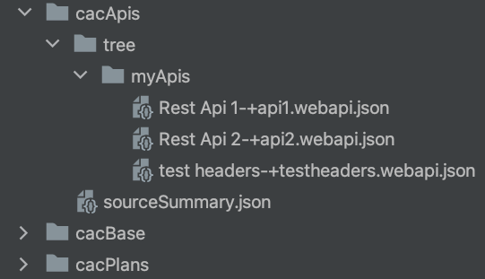
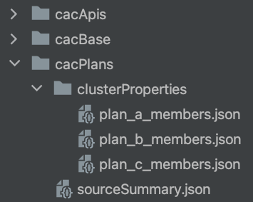
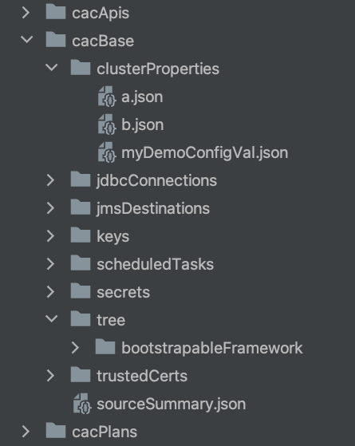

# Using graphman-client as part of applying configuration-as-code

Using graphman-client, you can create source-of-truth repositories to automate the configuration of your Layer7 Gateways.

These source-of-truth repositories can be monitored by the Layer7 Kubernetes Operator which applies the latest version of the configuration from these repositories.

## Creating a Configuration-as-code source-of-truth repository

Using the graphman client, you can create your own Layer7 gateway configuration source-of-truth repositories.

These repositories are used to hold your configuration files which can then be applied on target gateways using the graphman client connecting to your target gateway or automatically using the Layer7 Kubernetes Operator.

Starting from an existing gateway, you can pull the configuration that you want to include in your repo by specifying the corresponding query. For example, to start with the total gateway configuration, use the 'all' query as illustrated below.
```
./graphman.sh export --using all --output mybundle.json
```
Then, explode the configuration in a directory that will contain your repo files.
```
./graphman.sh explode --input mybundle.json --output myrepo
```
Before checking in your repo, add the source summary which can be leveraged on the target side for mapping purposes.
```
./graphman.sh export --using summary --output myrepo/sourceSummary.json
```
You can now check this configuration into your repo of choice.
```
cd myrepo
git add .
git commit -m "initial commit"
git push
```

### Example configuration broken down across 3 layers of configuration

The complete configuration to reproduce this sample is in the file configAsCodeSeed.json.

This configuration is made up of policies and service declarations, cluster properties, jdbc and jms targets, etc.

1. All REST services are organized in the folder /myApis;
2. whereas all framework policies are under /bootstrapableFramework. All other dependencies like cluster properties are also included.
3. In particular, a few cluster properties control which API clients belong to which API plans which in turn sets their SLAs.

We will break these 3 "layers" of configuration into their separate repos so that they can have their own lifecycle, potentially governed by different teams.

To learn how this works, lets start with a manual separation of the configuration entities

#### Step 1, explode the configuration:
```
./graphman.sh explode --input configAsCodeSeed.json --output cacBase
```

#### Step 2, make two copies
```
cp -R cacBase cacApis
cp -R cacBase cacPlans
```

#### Step 3, isolate each element

The APIs repo should only include the APIs. All other files can be deleted.



The Plans repo should only include the cluster wide properties that control the plan memberships. All other files can be deleted.



And finally, you can remove the APIs and the Plan configuration from the base repo.



You can now push these to their respective git targets and configure the operator to apply them separately to your gateway pods as instructed in the last section.

### Beyond manual isolation, automating repo creation and updates

Isolating different sets of entities from an all encompassing seed is one way to separate your gateway configuration across repositories. A more automated way is to use graphman queries that target the subset of what you are looking for directly and graphman will exclusively return these entities.

The 3 repos created earlier can also be pulled directly using graphman export command, you just need to use the corresponding query.

The example queries included listed below illustrate how to query for each subset of config:  
1. apis.gql
2. plansCWPs.gql
3. myFramework.gql

The creation of these specific queries avoid the manual isolation described in the basic example and make the creation of these repos more repeatable.

To further remove any overlap, use the graphman diff command as documented in the graphman-client Readme.


## Applying source-of-truth repositories using the Layer7 Kubernetes Operator

In the gateway custom resource, you can register one of more configuration repositories:
```
    repositoryReferences:
      - name: config-base
        enabled: true
        directories:
        - /
        type: dynamic
      - name: config-plans
        enabled: true
        directories:
          - /
        type: dynamic
      - name: config-apis
        enabled: true
        directories:
          - /
        type: dynamic
```

Each of these has its own custom resource yaml:

```
apiVersion: security.brcmlabs.com/v1
kind: Repository
metadata:
  name: config-apis
spec:
  name: config-apis
  enabled: true
  endpoint: https://github.corp.io/configmaster/cacApis
  branch: main
  sync:
    # sync interval in seconds
    interval: 30
  auth:
    vendor: Github
    username: operatorFoo
    existingSecretName: mygitsecret
```

Consult the Layer7 Operator for more details.

## Applying source-of-truth repositories without an Operator

Whether your target environment is not running on Kubernetes or if you prefer to apply configuration changes without using Operator, you can instead use graphman client targeting your target nodes graphman directly.

The assumption is that if you are not using the Operator to apply the configuration to each node of a cluster, something replaces this capability such as a Jenkins pipeline.

The graphman client documentation describes how to use the import command. The process on the target side follows these steps:
1. pull latest repo
2. package the config in a bundle using the graphman client implode command
3. apply to each gateway node's graphman (if db less) or to one node for each db cluster using the graphman client import command

Consult the graphman client documentation for more details on using the implode and the import commands.
